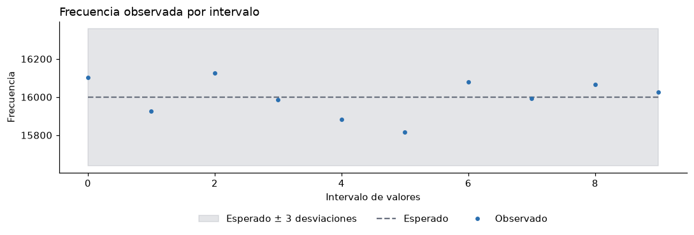
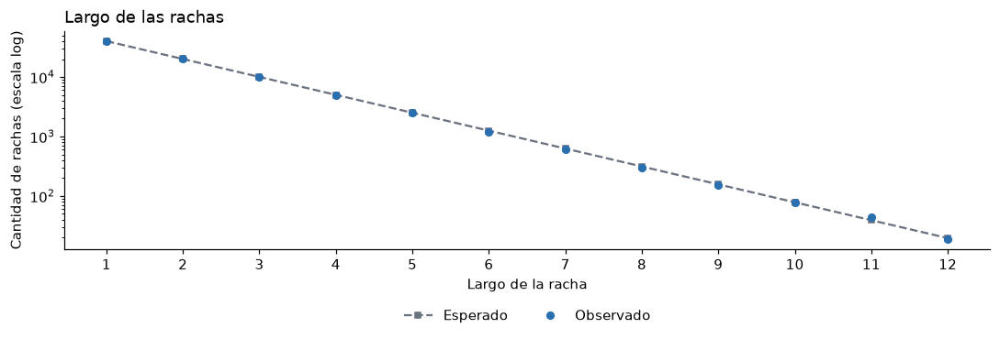
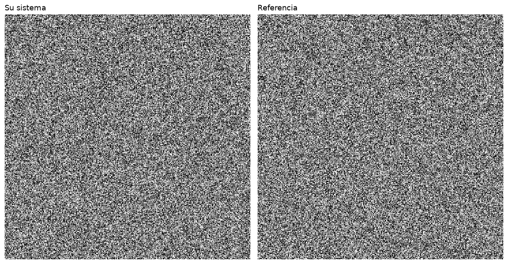
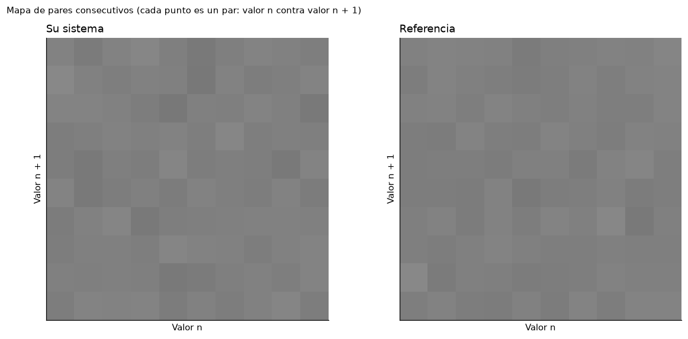

# mobile_entropy

Generador de números aleatorios que usa como fuente física las mediciones del acelerómetro de un teléfono celular. Produce 160,000 enteros entre 0 y 9 que se evalúan con el notebook `Verificador_TRNG.ipynb` proporcionado en el curso.

**Resumen honesto del sistema.** La implementación actual es un sistema **híbrido**: el acelerómetro aporta 33,793 bits físicos acondicionados y, a partir de ellos, SHA-256 con un contador genera de forma determinista la cantidad de bits necesaria para los 160,000 enteros. Los enteros finales pasan las pruebas estadísticas del verificador, pero eso **no demuestra** aleatoriedad verdadera ni impredecibilidad criptográfica (ver [Limitaciones](#limitaciones-y-alcance-de-los-resultados)).

## Estructura del proyecto

| Archivo o carpeta | Contenido |
|---|---|
| `datos/` | 9 archivos `.zip` exportados de la aplicación Phyphox: `quieto1-3`, `mano1-3` y `movimiento1-3`. Cada uno contiene `Raw Data.csv` con unos 60 s de mediciones. |
| `main.py` | Análisis exploratorio: calcula la desviación estándar de cada eje en cada grabación y la grafica, para comparar cuánto varía la señal en cada condición. |
| `extractor.py` | Convierte las mediciones en bits crudos y los acondiciona con Von Neumann. Genera `bits_crudos.txt` y `bits_acondicionados.txt`. |
| `hashing.py` | Expande los bits acondicionados con SHA-256 y un contador, y los convierte en 160,000 enteros del 0 al 9. Genera `enteros.csv`. |
| `pruebas_bits.py` | Evalúa los bits físicos (antes del hashing): balance, correlación entre bits consecutivos y prueba de rachas. |
| `Verificador_TRNG.ipynb` | Notebook del profesor: chi cuadrado, rachas, pares consecutivos y prueba visual de 400 × 400 píxeles sobre `enteros.csv`. |
| `images/` | Capturas de las gráficas del verificador. |

### Funcionamiento paso a paso

1. **Lectura.** `extractor.py` abre cada `.zip` con `zipfile` y lee `Raw Data.csv` con `pandas`, sin descomprimir nada en disco. Todo el procesamiento ocurre en memoria; no se crean archivos ni carpetas intermedias.
2. **Cambios entre mediciones.** Para cada grabación y cada eje (X, Y, Z) se calcula la diferencia entre una medición y la anterior (`diff()`). Las diferencias se calculan por separado dentro de cada grabación y cada eje, por lo que nunca se resta una medición de una grabación o eje distinto.
3. **Bits crudos.** Cada cambio se convierte en un bit: `1` si el cambio es positivo y `0` si es negativo o cero (solo hubo 12 cambios exactamente iguales a cero en 162,675). Se obtienen **162,675 bits crudos**, en el orden: grabación 1 (eje X, luego Y, luego Z), grabación 2, etc.
4. **Acondicionamiento de Von Neumann.** Los bits se toman en pares no superpuestos. El par `01` produce `0`, el par `10` produce `1`, y los pares `00` y `11` se descartan. Quedan **33,793 bits acondicionados**.
5. **Expansión con SHA-256.** `hashing.py` calcula 4,100 veces `SHA-256(bits_acondicionados + contador)`, con el contador de 0 a 4,099, y concatena los resultados: 4,100 × 256 = **1,049,600 bits**.
6. **Enteros del 0 al 9.** Los bits se agrupan de 4 en 4 (valores de 0 a 15). Se conservan solo los valores menores que 10 (muestreo por rechazo, para que los 10 dígitos sean igual de probables) y se toman los primeros **160,000**.

## Cómo ejecutar el proyecto

Los comandos siguientes son para Windows (PowerShell) y se ejecutan **dentro de la carpeta `mobile_entropy`**, que es donde están `datos/` y los scripts.

1. **Instalar las dependencias** (Python 3.11 o superior):
   ```
   python -m venv .venv
   .venv\Scripts\Activate.ps1
   pip install -r requirements.txt
   ```
   En macOS o Linux, la activación es `source .venv/bin/activate`.

2. **(Opcional) Análisis exploratorio:** `python main.py`. Imprime la desviación estándar de cada eje y abre una gráfica de barras con la variación promedio de las 9 grabaciones. No genera archivos.

3. **Extraer los bits:** `python extractor.py`. Escribe `bits_crudos.txt` (162,675 bits) y `bits_acondicionados.txt` (33,793 bits).

4. **Generar los enteros:** `python hashing.py`. Escribe `enteros.csv` (160,000 enteros en una sola fila separada por comas).

5. **Evaluar los bits físicos:** `python pruebas_bits.py`. Solo lee archivos; no modifica nada.

6. **Ejecutar el verificador:** `jupyter notebook Verificador_TRNG.ipynb` y luego *Run All*. El notebook carga `enteros.csv` con `VALOR_MIN = 0` y `VALOR_MAX = 9`.

El proceso es determinista: volver a ejecutar los pasos 3 y 4 sobre los mismos `.zip` produce exactamente los mismos archivos que ya están en el repositorio.

**Cómo interpretar los resultados.** En cada prueba, un valor p menor que 0.01 significa **NO PASA**: la desviación es demasiado grande para atribuirla a la casualidad. Un valor p entre 0.01 y 0.99 significa **PASA**: no se detectó ese tipo de problema, lo cual no demuestra que no existan otros. En las pruebas de chi cuadrado del notebook, un valor p mayor que 0.99 se marca como **SOSPECHOSO**, porque los datos serían demasiado regulares.

## Fuente física y justificación

### Qué mide el acelerómetro

El acelerómetro es un sensor MEMS (microelectromecánico) que mide la aceleración del teléfono en tres ejes perpendiculares: X (ancho del teléfono), Y (alto) y Z (perpendicular a la pantalla), en m/s². Las grabaciones se tomaron con Phyphox en un iPhone, a una frecuencia media de **99.66 Hz**, durante un total de **544.1 s** (54,234 mediciones en las 9 grabaciones).

Usamos la columna **`Linear Acceleration`** de Phyphox. Esta **no es la lectura directa del sensor**: es una señal que **calcula el sistema operativo del teléfono**, restándole la gravedad y combinando la información del acelerómetro con la de otros sensores (fusión de sensores). Ese procesamiento puede filtrar y suavizar la señal.

### Por qué las variaciones pueden aportar entropía

Cada medición combina el movimiento real del teléfono con pequeñas perturbaciones que son difíciles de predecir:

- **Ruido electrónico del sensor** (por ejemplo, ruido térmico en la electrónica MEMS y en la conversión analógica-digital).
- **Microvibraciones** del entorno y del cuerpo de quien sostiene el teléfono.
- En las condiciones "mano" y "movimiento", **movimientos involuntarios** del cuerpo.

Estas son **posibles** fuentes de entropía. No medimos por separado cuánto aporta cada una, así que su contribución individual **no está demostrada**. Lo que sí podemos decir con nuestros datos es lo siguiente:

- Incluso con el teléfono quieto, la señal no es constante. La desviación estándar es de unos 0.007 a 0.019 m/s², y casi ninguna medición se repite exactamente.
- En reposo, la correlación entre bits consecutivos (alrededor de −0.28) es **compatible** con lo que se espera de cambios de ruido independiente (−1/3, ver abajo). Esto sugiere que en reposo domina el ruido, pero no prueba de dónde viene ese ruido.

### Por qué existe correlación entre bits

Los resultados de `pruebas_bits.py` (sección siguiente) muestran que los bits crudos **no son independientes**. Hay tres causas principales:

1. **Dos cambios consecutivos comparten una medición.** Como `cambio₁ = a₁ − a₀` y `cambio₂ = a₂ − a₁`, ambos dependen de `a₁`. Incluso si las mediciones fueran ruido puro e independiente, la correlación entre los bits resultantes sería de aproximadamente **−1/3**: después de una subida es más probable una bajada. Las grabaciones en reposo (entre −0.27 y −0.29) están cerca de ese valor.
2. **El movimiento real es lento comparado con 100 Hz.** Cuando la mano o el cuerpo se mueven, la aceleración sube o baja durante varias mediciones seguidas, lo que produce bits iguales consecutivos. Por eso la correlación es **positiva** en "mano" (+0.13 a +0.47) y en "movimiento" (+0.28 a +0.59).
3. **El filtrado de `Linear Acceleration`** suaviza la señal y refuerza esa dependencia.

### Qué hace y qué no hace Von Neumann

Von Neumann elimina el sesgo **si los bits de entrada son independientes y tienen siempre la misma probabilidad de ser 1**. En ese caso, los pares `01` y `10` son igual de probables, así que la salida queda balanceada.

Nuestros bits no cumplen ese supuesto. Von Neumann logró **equilibrar** ceros y unos (50.03 % de unos), pero **no eliminó la dependencia**: los pares consecutivos siguen relacionados entre sí, y los bits acondicionados fallan las pruebas de correlación y de rachas. Un balance 50/50 no implica independencia; por ejemplo, la secuencia `010101...` está perfectamente balanceada y es totalmente predecible.

Además, como los bits de todas las grabaciones y ejes se concatenan antes de formar pares, unos pocos pares (en las fronteras entre ejes o grabaciones) combinan bits de series distintas. El efecto es mínimo, pero conviene saberlo.

## Resultados de los bits físicos (`pruebas_bits.py`)

Resultados obtenidos al ejecutar `python pruebas_bits.py` sobre los archivos del repositorio (nivel de significancia 0.01):

| Prueba | Bits crudos (162,675) | Bits acondicionados (33,793) |
|---|---|---|
| Ceros / unos | 81,518 (50.11 %) / 81,157 (49.89 %) | 16,886 (49.97 %) / 16,907 (50.03 %) |
| Balance (monobit) | z = −0.895, p = 0.3708 → **PASA** | z = 0.114, p = 0.9091 → **PASA** |
| Correlación entre bits consecutivos | r = +0.1713, p ≈ 0 → **NO PASA** | r = −0.0688, p ≈ 1.1 × 10⁻³⁶ → **NO PASA** |
| Rachas (Wald-Wolfowitz) | 67,405 observadas vs 81,338.1 esperadas, z = −69.09, p ≈ 0 → **NO PASA** | 18,060 observadas vs 16,897.5 esperadas, z = 12.65, p ≈ 1.1 × 10⁻³⁶ → **NO PASA** |

*"p ≈ 0" significa que el valor es menor que la precisión numérica de la computadora.*

Correlación entre bits consecutivos por grabación y eje (con ruido independiente se esperaría alrededor de −0.33):

| Grabación | Eje X | Eje Y | Eje Z |
|---|---:|---:|---:|
| quieto1 | −0.284 | −0.258 | −0.283 |
| quieto2 | −0.286 | −0.291 | −0.279 |
| quieto3 | −0.280 | −0.293 | −0.274 |
| mano1 | +0.325 | +0.129 | +0.358 |
| mano2 | +0.291 | +0.292 | +0.384 |
| mano3 | +0.415 | +0.255 | +0.468 |
| movimiento1 | +0.589 | +0.561 | +0.571 |
| movimiento2 | +0.542 | +0.490 | +0.576 |
| movimiento3 | +0.302 | +0.309 | +0.277 |

**Interpretación.**

- Los bits crudos están balanceados, pero tienen menos rachas de las esperadas: tienden a repetirse.
- Los bits acondicionados también están balanceados, pero tienen **más** rachas de las esperadas: tienden a alternarse.
- En ambos casos la secuencia física **no se comporta como bits independientes**.
- En la tabla por grabación, la correlación global de los bits crudos (+0.17) es la mezcla de la correlación negativa en reposo y la positiva al moverse.

**Limitaciones de estas pruebas.**

- La prueba de balance no mira el orden de los bits.
- La correlación solo detecta dependencia lineal entre vecinos inmediatos.
- La prueba de rachas no detecta patrones que no cambien el número de rachas.
- Pasar una prueba no demuestra aleatoriedad; fallarla sí indica un problema real.

## Resultados del verificador (160,000 enteros finales)

`enteros.csv` contiene exactamente 160,000 enteros entre 0 y 9, y aparecen los 10 valores posibles. El notebook se ejecutó con `VALOR_MIN = 0`, `VALOR_MAX = 9` y un nivel de significancia de 0.01:

| Prueba | Estadístico | gl | p-valor | Veredicto |
|---|---:|---:|---:|---|
| Chi cuadrado (uniformidad) | 5.683 | 9 | 0.7712 | PASA |
| Rachas (orden) | z = 1.545 | – | 0.1223 | PASA |
| Pares consecutivos | 109.415 | 99 | 0.2228 | PASA |

1. **Chi cuadrado.**
   
   Las frecuencias de los 10 dígitos varían entre 15,816 y 16,127, alrededor de las 16,000 esperadas. Todas quedan dentro de la banda gris de **±3 desviaciones estándar**, y no se observa una forma clara (colina, pendiente o hueco) que indique sesgo.

2. **Rachas.**
   
   Hubo 80,310 rachas, frente a 80,001 esperadas, y la distribución de largos de racha sigue la curva esperada. No se detecta que los valores se queden pegados en una zona ni que alternen de forma artificial.

3. **Pares consecutivos.**
   Con 10 niveles hay 100 combinaciones, con una frecuencia esperada de 800 por combinación. El estadístico es χ² = 109.41 con 99 grados de libertad (p = 0.2228), así que no se detecta que un valor condicione al siguiente.

4. **Prueba visual (400 × 400 píxeles).**
   
   La imagen del sistema se ve como ruido uniforme, sin bandas, diagonales, bloques repetidos ni zonas más claras u oscuras, y no se distingue a simple vista de la referencia. *(La imagen guardada es una captura del notebook con los dos paneles; el notebook genera cada panel con exactamente 400 × 400 píxeles.)*
   
   El mapa de pares consecutivos es un gris parejo, sin líneas, rejillas ni huecos.

## Limitaciones y alcance de los resultados

**Qué hace realmente `hashing.py`.** SHA-256 con un contador es una **expansión determinista**. Con la misma entrada siempre produce la misma salida, y **no crea entropía física nueva**. El balance es el siguiente:

| Concepto | Cantidad |
|---|---:|
| Bits físicos acondicionados que entran | 33,793 |
| Bits generados por SHA-256 | 1,049,600 (31 veces más) |
| Información contenida en 160,000 dígitos del 0 al 9 (160,000 × log₂10) | ≈ 531,508 bits |

Aun suponiendo, con optimismo, que cada bit acondicionado tuviera 1 bit completo de entropía, la salida contiene al menos **15.7 veces más bits de información que la entropía física disponible**. Además, los bits acondicionados están correlacionados, así que su entropía real es menor que 33,793 bits. Por lo tanto, los 160,000 enteros **no** son 160,000 números verdaderamente aleatorios e independientes: son la salida de un generador determinista sembrado con datos físicos.

**Por qué los resultados favorables no demuestran aleatoriedad verdadera.** SHA-256 produce salidas con apariencia uniforme para **cualquier** entrada. En la auditoría del proyecto se comprobó que, al reemplazar los bits físicos por una cadena fija (por ejemplo `"hola"` o 33,793 ceros), la salida también pasa las tres pruebas del verificador. Esto significa que las pruebas sobre `enteros.csv` evalúan principalmente la calidad de SHA-256, no la de la fuente física. La calidad de la fuente física se evalúa en la sección de `pruebas_bits.py`, y ahí los bits **no pasan** las pruebas de independencia.

**Reproducibilidad e impredecibilidad.** `bits_acondicionados.txt` está publicado en este repositorio. Cualquier persona puede ejecutar `hashing.py` y obtener exactamente el mismo `enteros.csv`. Esto es útil para revisar el trabajo, pero significa que la salida **no es secreta ni impredecible**, y no debe usarse con fines criptográficos.

**Lo que sí logramos.**

- Capturamos datos físicos reales en tres condiciones y construimos un extractor reproducible.
- Medimos cuantitativamente la calidad de los bits físicos, identificamos sus problemas (correlación) y explicamos sus causas.
- Generamos 160,000 enteros uniformes en [0, 9] que pasan las pruebas del verificador, entendiendo qué parte de ese resultado se debe a la fuente física y qué parte a SHA-256.

**Mejoras futuras.**

- Usar datos del acelerómetro **menos procesados** (en Phyphox, "Acceleration (with g)" o el sensor sin fusión), para evitar el filtrado de `Linear Acceleration`.
- Preferir grabaciones en reposo, donde la correlación se parece más a la de ruido independiente.
- Usar un extractor que no dependa de cambios consecutivos.
- Usar SHA-256 **sin expansión**, es decir, sin producir más bits que la entropía física que entra. Para eso hacen falta más horas de grabación (ver la sección siguiente).

## Escalabilidad para 365 días

### Tasas medidas con nuestros datos

Todas las tasas salen de nuestras 9 grabaciones (544.1 s en total). Suponen que un sensor a 100 Hz se comporta como el del teléfono, lo cual **habría que confirmar** con el sensor real.

| Magnitud | Por segundo | Por día | En 365 días |
|---|---:|---:|---:|
| Mediciones (1 por eje) | ≈ 99.7 × 3 ejes | ≈ 25.8 millones | ≈ 9,430 millones |
| Bits crudos | ≈ 299 | ≈ 25.8 millones | ≈ 9,430 millones |
| Bits acondicionados (Von Neumann) | ≈ 62.1 | ≈ 5.37 millones | ≈ 1,959 millones |
| Dígitos 0–9 **sin expansión** (cota superior)* | ≈ 9.7 | ≈ 838,000 | ≈ 306 millones |

\* Esta cifra resulta de dividir los bits acondicionados entre 4 y conservar 10 de cada 16 grupos. Es una **cota superior**, porque supone que cada bit acondicionado aporta 1 bit de entropía, cosa que no se cumple por la correlación medida.

**Tasa física frente a tasa expandida.** La tasa de bits **físicos** acondicionados es de unos 62 bits/s. La salida de SHA-256 con contador **no tiene límite físico**: puede producir tantos bits como se quiera a partir de la misma semilla, pero sin añadir entropía. Con la proporción actual (160,000 dígitos a partir de 544 s de grabación), equivale a unos 294 dígitos por segundo de grabación, unas 30 veces más que la cota física. Para un servicio honesto, la tasa que importa es la física.

**Meta de un número por segundo.** Generar 1 dígito por segundo durante 365 días son 31,536,000 dígitos. Esto está por debajo de la cota física estimada (unos 9.7 dígitos por segundo), así que la meta es alcanzable **sin** expansión, siempre que se use SHA-256 como acondicionador y no como expansor.

### Almacenamiento

| Qué se guarda | Tamaño en 365 días |
|---|---:|
| Bits acondicionados, empaquetados (8 bits por byte) | ≈ 245 MB |
| Bits acondicionados como texto (1 carácter por bit, como `bits_acondicionados.txt`) | ≈ 1.96 GB |
| 1 dígito por segundo en CSV (dígito + coma) | ≈ 63 MB |
| Bits crudos como texto (si se quisieran archivar) | ≈ 9.4 GB |

Un SSD de 120 GB alcanza con amplio margen. No es necesario guardar las mediciones crudas; basta con conservar muestras periódicas para auditar el sistema.

### Hardware y operación continua

1. **Raspberry Pi 4.** Es pequeña, consume poca energía y tiene capacidad suficiente para ejecutar Python continuamente. El procesamiento por segundo (unas 300 mediciones y unos cuantos hashes) es mínimo para ella.
2. **Sensor de aceleración.** Un acelerómetro MEMS conectado por I²C o SPI y configurado a unos 100 Hz, con dos sensores de repuesto. Conviene montarlo sobre una superficie fija; según nuestros datos, en reposo la correlación entre bits es la más cercana a la de ruido independiente.
3. **SSD.** Para el sistema operativo y los registros, evitando el desgaste de las tarjetas microSD.
4. **Procesamiento en RAM.** El extractor, Von Neumann y SHA-256 se aplican en memoria, en bloques. Por ejemplo, se acumulan 256 bits acondicionados y cada bloque se transforma en 256 bits de salida, sin expansión. Los números listos se guardan en un búfer en memoria.
5. **Funcionamiento continuo.**
   - El programa corre como servicio del sistema (por ejemplo, con `systemd` y `Restart=always`), para que se reinicie solo si falla o si se va la luz.
   - Un Mini-UPS cubre cortes eléctricos breves.
   - Un **control de salud** aplica periódicamente las pruebas de `pruebas_bits.py` a cada lote. Si el sensor se desconecta o entrega valores constantes, el sistema deja de entregar números en lugar de entregar números de baja calidad.
   - Se guardan registros (logs) y se revisa el equipo en el mantenimiento anual.

### Limitaciones de las estimaciones

- Las tasas provienen de unos 9 minutos de datos de un teléfono, no del sensor propuesto.
- La entropía real por bit es menor que 1 por la correlación medida, así que la cota de 9.7 dígitos/s es optimista.
- Sin acondicionamiento adicional, los bits físicos no pasan las pruebas de independencia, así que en producción el uso de SHA-256 como acondicionador (sin expansión) es necesario.

## Costos e infraestructura

### Opción 1: hardware local (propuesta original)

El presupuesto se divide en **CapEx** (inversión inicial en componentes) y **OpEx** (gastos para mantener el sistema funcionando). Los precios son estimaciones del equipo; no fueron verificados con un proveedor específico.

| Componente | Tipo | Costo (USD) | Supuesto |
|---|---|---:|---|
| Raspberry Pi 4 (4 GB) | CapEx | $75.00 | Precio de referencia de mercado |
| 3 sensores de aceleración | CapEx | $15.00 | Unos $5 por módulo MEMS (1 en uso y 2 de repuesto) |
| SSD de 120 GB | CapEx | $25.00 | – |
| Batería de respaldo (Mini-UPS) | CapEx | $40.00 | Para cortes breves |
| Caja protectora y cables | CapEx | $20.00 | – |
| Electricidad anual | OpEx | $12.50 | A unos 5 W continuos son ≈ 43.8 kWh/año, lo que implica ≈ $0.29/kWh. **Confirmar con la tarifa eléctrica local.** |
| Mantenimiento anual | OpEx | $30.00 | Reposición de piezas o cables |
| **Total estimado del primer año** | | **$217.50** | CapEx $175.00 + OpEx $42.50 |

A partir del segundo año, el costo estimado es de unos $42.50 por año (solo OpEx).

### Opción 2: hardware local + Cloudflare para publicar la API

**Cloudflare no captura entropía física.** La entropía sigue viniendo del sensor conectado a la Raspberry Pi. Cloudflare solo sirve para **publicar** los números en Internet de forma segura y, si se desea, **archivarlos**.

**Arquitectura:**

1. La Raspberry Pi captura el sensor, extrae los bits, aplica Von Neumann y SHA-256 (sin expansión), y mantiene un búfer de números listos.
2. Un pequeño servidor HTTP local en la Pi (por ejemplo, con Python) responde en una ruta como `/numero`.
3. **Cloudflare Tunnel** (`cloudflared`) conecta la Pi con la red de Cloudflare mediante una conexión **solo de salida**, sin abrir puertos ni necesitar una IP pública.
4. *(Opcional)* Un **Cloudflare Worker** actúa como puerta de entrada pública: limita la cantidad de solicitudes por usuario y devuelve un error claro si la Pi no está disponible.
5. *(Opcional)* **Cloudflare R2** guarda un archivo diario con los números entregados, para auditarlos después.

**Volumen supuesto:** 1 solicitud por segundo equivale a 86,400 solicitudes por día y unos 2.6 millones por mes. Si se archiva 1 archivo por hora en R2, son unas 730 escrituras al mes y unos 63 MB en un año.

| Componente | Precio publicado por Cloudflare | Uso estimado | Costo anual estimado (USD) |
|---|---|---|---:|
| Hardware local (Opción 1) | – | – | $217.50 |
| Cloudflare Tunnel | Gratuito en todos los planes | 1 túnel | $0.00 |
| Cloudflare Workers, plan Free | 100,000 solicitudes por día y 10 ms de CPU por solicitud | 86,400 solicitudes/día (cabe, con poco margen) | $0.00 |
| Cloudflare Workers, plan Paid (si se supera el plan gratuito) | $5/mes, con 10 millones de solicitudes incluidas; luego $0.30 por millón adicional | ≈ 2.6 millones/mes | $60.00 (solo si hace falta) |
| Cloudflare R2 (opcional) | Gratis hasta 10 GB-mes, 1 millón de operaciones Clase A y 10 millones Clase B al mes; luego $0.015/GB-mes. Salida de datos gratuita. | ≈ 63 MB y ≈ 730 escrituras/mes | $0.00 |
| Dominio propio (necesario para una dirección fija del túnel) | Depende de la extensión y del registrador | 1 dominio | **Pendiente de confirmar** (estimación: unos $10–15/año para un `.com`) |
| **Total primer año, planes gratuitos** | | | **≈ $217.50 + dominio** |
| **Total primer año, con Workers Paid** | | | **≈ $277.50 + dominio** |

Precios consultados el 9 de octubre de 2026 en la documentación oficial de Cloudflare ([Workers](https://developers.cloudflare.com/workers/platform/pricing/), [R2](https://developers.cloudflare.com/r2/pricing/), [Tunnel](https://developers.cloudflare.com/cloudflare-one/connections/connect-networks/) y su [página de planes](https://www.cloudflare.com/plans/)). Pueden cambiar. El costo del dominio **no** fue verificado.

**Supuestos y riesgos de esta opción.**

- Se supone que la Pi tiene una conexión a Internet que ya existe (su costo no está incluido).
- Si la Pi o el sensor fallan, la API no puede entregar números nuevos. Cloudflare no los reemplaza.
- Para enviar números a clientes por Internet se necesita HTTPS (Cloudflare lo proporciona).

Esta propuesta busca un equilibrio entre la cantidad de números generados y el costo, y se mantiene al alcance de un equipo de estudiantes. El sistema consume poca energía, no depende de un teléfono móvil y puede ofrecer sus números mediante una API durante los 365 días.
